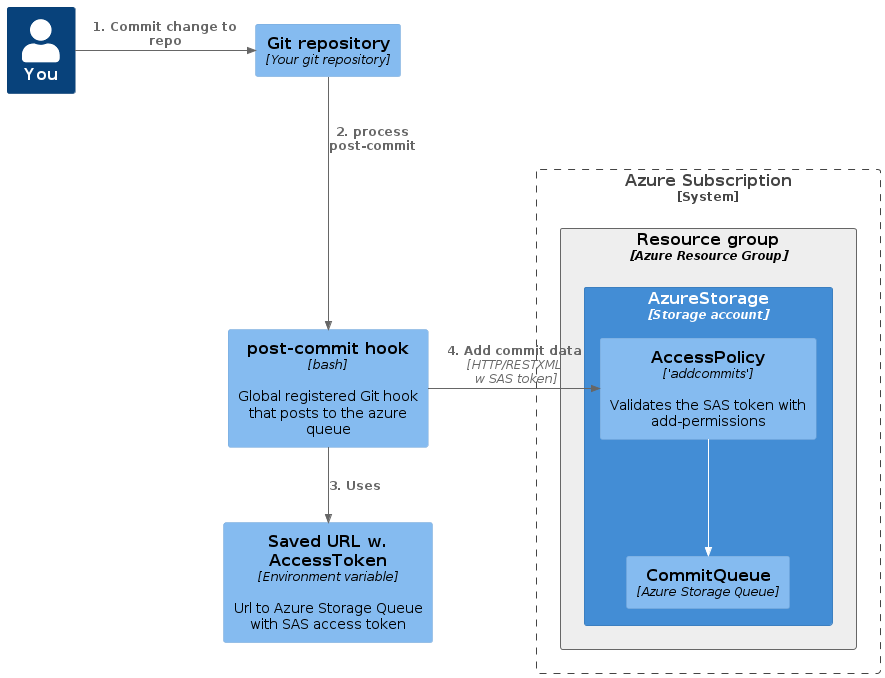
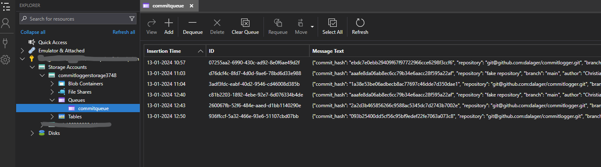
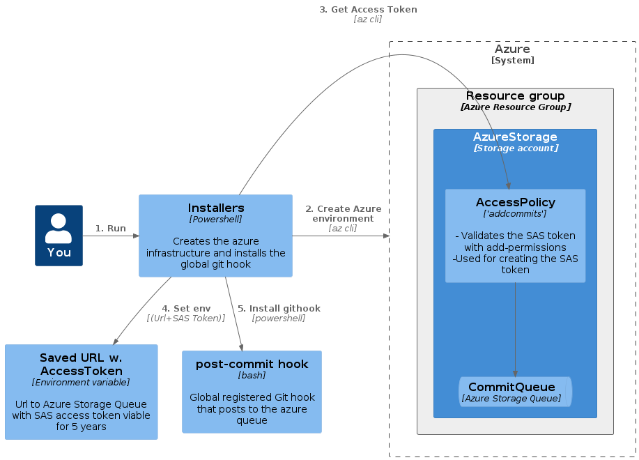

# Git commits to Azure Storage Queue

This is a simple tool that tracks commits across all your git repositories and logs them to an [Azure Storage Queue](https://learn.microsoft.com/en-us/azure/storage/queues/storage-queues-introduction) as json.

From here you can hook it up to functions, logicapps, local apps or something else to store or process elsewhere.

It was made to help me track what I am working on.

## How it works

It works by installing a global git hook that will be called after each commit and will HTTP post some commit details to the Azure Storage Queue using a [Secure Access Signature (SAS)](https://docs.microsoft.com/en-us/azure/storage/common/storage-sas-overview).
The credentials are long lived - 5 years as default - and stored in an environment variable.



## Storage format

The format of the json is quite simple.

```json
{
  "commit_hash": "093b25400dd5cf56c95bf0000022fe7063a073c8",
  "repository": "git@github.com:dalager/commitlogger.git",
  "branch": "main",
  "author": "Christian Dalager",
  "commit_message": "Updating readme"
}
```

And it ends up in the queue like this



# Installation

There is two steps to the installation.

1. Setup Azure infrastructure
2. Install git hook



## 1. Setup Azure infrastructure

Using only the Azure CLI and Powershell, this will create the following resources

- Resource group `commitlogger-rg`
- Storage account, Standard LRS, `commitloggerstorage<+RandomInt>`
- Storage queue `commitqueue`
- Access policy "addcommits" with only add permissions to the queue
- An Secure Access Signature (SAS) token that can be used to post to the queue

This is a VERY simple and almost free setup. The storage account is the only thing that will cost you money, and it will cost you almost nothing.
Unless you are an insane commit machine, of course. Which you are not. Right?

### Pre-requisites

- Powershell
- Azure subscription
- Install of [Azure CLI](https://docs.microsoft.com/en-us/cli/azure/install-azure-cli?view=azure-cli-latest)

### Run the following commands

If you have not already setup your Azure CLI, run the following commands to login and set the subscription

```powershell
>az login
>az account set --subscription <subscription id>
```

And then run the following command to create the azure resources and the environment variable

```powershell
>.\iac\create_resources.ps1
```

## 2. Install hook

Sets up a global git hook that will be called after each commit and will post the commit to the azure queue.

Any local `post-commit` hook will be called after the global hook.

### Run the following command

```powershell
>.\hooks\install_global_hook.ps1
```

Take a look at the [post-commit](hooks/post-commit) hook to see what it does.

## Post install state

- The resource group `commitlogger-rg` contains the storage account and the queue with the logs
- The environment variable `COMMITLOGGER_QUEUE_URL` contains the authorized post url to the queue
- There is a global `post-commit` hook installed in `~/.git-hooks` that will post to the queue after each commit
- If you have a local `post-commit` hook in your repository, it will be called after the global hook

## Test the endpoint

With VS code and the restclient extension you can test the endpoint by opening the [push_test_message_to_endpoint.http](push_test_message_to_endpoint.http) file and sending the request.

Then open the storage queue in either the [Azure portal](https://portal.azure.com/) or with the [Azure Storage Explorer](https://azure.microsoft.com/en-us/features/storage-explorer/).

### Cleanup

Run the following commands to clean up the resources

`>.\iac\drop_resources.ps1`
Will delete the resource group and all resources in it and the environment variable `COMMITLOGGER_QUEUE_URL`

`>.\hooks\uninstall_global_hook.ps1`

Will uninstall the global git hook

## Known issues

### GitUI

On windows with `gitui` (https://github.com/extrawurst/gitui) the global hook is not called due to som issue with rust and hook path resolution/environment. I think.
This means that as of now gitui cannot be used. Issue #2.
